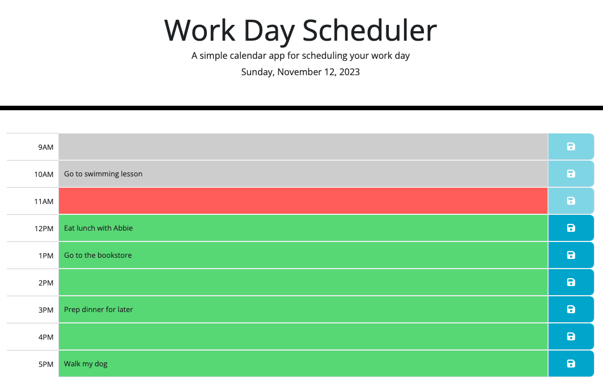

# Work Day Scheduler

This planner allows for a user to set tasks for their work day, from 9am to 5pm and be able to save their tasks to local storage. So, if they were to leave the page or refresh it, their tasks will remain on screen.

I have taken this task one step further and disabled the input and save buttons for tasks that are in the past (grey) or currently happening (red), as to mimic a real-life situation.

The application format currently stands where if an event is in the past, the timeblock changes to grey, if the event is happening now, the timeblock is in red and if the event is in the future the timeblock is in green. This functionality makes it easy for the user to see what events are still to come and what events have already happened.

## Application Appearance

View live project [here](https://leannecodes.github.io/work-planner/)

## Usage

When the user clicks the save button next to each input field, the data is stored to local storage. To view the save data, follow these steps:
1. Right-click on the page and choose Inspect
2. Navigate to the Application tab
3. Click on Local Storage to the left
4. Select your http page you're viewing the work day scheduler on

You should see something similar below:

## Future Implementations
- Allow the user to remove individual items from local storage
- Disable the save button for future events, when there's no text in the input field
- Alert users when an events has been added or removed

## Credits
- DayJs to display the current date. View [source](https://day.js.org/docs/en/display/format)
- Bootstrap for the grid template. View [source](https://getbootstrap.com/docs/5.3/forms/layout/)
- MDN docs for the .matches() syntax. View [source](https://developer.mozilla.org/en-US/docs/Web/API/Element/matches)
- Stack Overflow for a guide to submit to local storage. View [source](https://stackoverflow.com/questions/17087636/how-to-save-data-from-a-form-with-html5-local-storage)
- Stack Overflow for the guide on using focus selectors. View [source](https://stackoverflow.com/questions/39994974/changing-the-background-colour-of-an-active-input-selector)
- FontAwesome for the floppy disk icon on the save button. View [source](https://fontawesome.com/search?q=floppy%20disk&o=r&m=free)